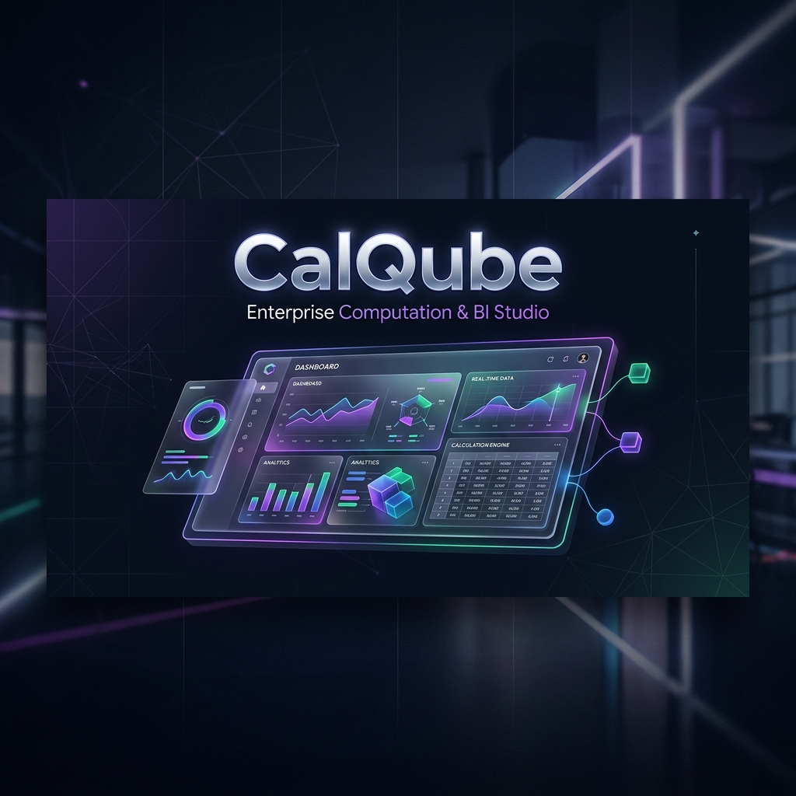
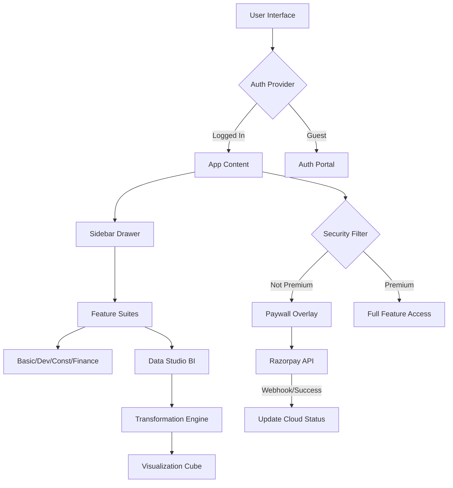

<div align="center">
  

  # 💎 CalQube: Enterprise SaaS Calculation & BI Suite
  
  **The definitive Micro-SaaS foundation featuring high-performance calculation logic, mobile-first BI analytics, and integrated commercial paywalls.**

  [](https://Mmaneesh007.github.io/calculator)
  [](https://react.dev/)
  [](https://vitejs.dev/)
  [](https://firebase.google.com/)
  [](https://razorpay.com/)
  [](https://web.dev/progressive-web-apps/)

  <p align="center">
    <a href="#-key-features">Key Features</a> •
    <a href="#-technical-stack">Technical Stack</a> •
    <a href="#-architecture">Architecture</a> •
    <a href="#-local-setup">Local Setup</a> •
    <a href="#-contact">Contact</a>
  </p>
</div>

---

## 🚀 Business Value & Overview

**CalQube** is a battle-tested **Software-as-a-Service (SaaS)** blueprint designed for high-value utility monetization. It solves the "utility gap" by providing complex calculation logic across multiple industries (Finance, Construction, Development) while securing them behind an enterprise-grade paywall and cloud-sync engine.

### 💼 Why CalQube?
- **Commercial Ready**: Production-grade Razorpay checkout flow with secure webhook-ready handling.
- **Mobile-First UX**: Fluid, touch-optimized design with a premium side-navigation drawer.
- **Real-time Persistence**: State-aware autosave functionality ensuring user data is never lost.
- **Micro-SaaS blueprint**: Scalable architecture ready for commercial deployment in minutes.

---

## 🌟 Key Features

### 📐 Multi-Vertical Suites
- **💻 Developer Suite**: Specialized tools for bitwise operations, color space management, and regex verification.
- **🏗️ Construction Suite**: Professional-grade material estimation, structural area calculations, and structural unit conversions.
- **📊 Finance Suite**: Advanced ROI calculators, compounding projections, and mortgage amortization engines.
- **🧪 Basic Logic**: The foundational engine for everyday high-precision calculations.

### 📉 Advanced Business Intelligence (BI)
- **Data Studio**: Enterprise-grade CSV/Excel ingestion with multi-sheet support.
- **Power Query Engine**: In-browser data transformation including duplicate removal, blank filtering, and column management.
- **DAX Engine**: Custom calculated column engine supporting complex JavaScript-based formulas.
- **Visualization Cube**: Dynamic, interactive reporting powered by **Recharts**.
- **Export Command**: One-click generation of professional **PDF** and **PNG** reports for stakeholders.

### 🔒 Premium Experience
- **Dynamic Paywall**: Intellectual property protection via blurred results and locked high-tier suites.
- **Cloud Sync**: Seamless Firestore integration for user profiles, saved dashboards, and cross-device state.
- **Activity Logging**: Real-time audit trail of all user actions and system events.

---

## 💻 Technical Stack

### **Frontend & UX**
- **React 19**: Concurrent rendering and the latest React ecosystem standards.
- **Vite & PWA**: Ultra-fast build times with **Progressive Web App** support for installability.
- **Vanilla CSS3**: Elite **Glassmorphism** styling with high-performance transitions—no heavy CSS frameworks.
- **Lucide React**: Consistent, high-fidelity iconography.
- **React Hot Toast**: Sleek, non-intrusive system notifications.

### **Backend & Cloud**
- **Firebase Auth**: Enterprise-grade identity management and RBAC.
- **Cloud Firestore**: Real-time NoSQL database with optimized security rules for SaaS state.
- **Razorpay SDK**: The gold standard for payment gateway integration in India.

### **Data & Utilities**
- **Recharts**: Responsive, SVG-based data visualization.
- **jsPDF & html2canvas**: Client-side enterprise reporting engine.
- **XLSX (SheetJS)**: Robust spreadsheet parsing for large datasets.

---

## 🏗️ Architecture

CalQube implements a **Unidirectional Data Flow** with a centralized state managed via the **React Context API**.



---

## 🛠️ Local Setup

Get CalQube running locally in under 3 minutes:

1. **Clone & Initialize**:
   ```bash
   git clone https://github.com/Mmaneesh007/calculator.git
   cd calculator
   npm install
   ```

2. **Environment Configuration**:
   Create a `.env` file in the root directory:
   ```env
   VITE_FIREBASE_API_KEY=your_firebase_key
   VITE_FIREBASE_AUTH_DOMAIN=your_project.firebaseapp.com
   VITE_FIREBASE_PROJECT_ID=your_project
   VITE_RAZORPAY_KEY_ID=your_razorpay_live_id
   ```

3. **Launch Production Server**:
   ```bash
   npm run dev
   ```

---

## 📧 Contact

**Manish Sau**  
*Founder & Lead Architect*

[](https://www.linkedin.com/in/manish-sau-2875b844/)
[](mailto:maneeshsau2002@gmail.com)

---

<div align="center">
  <sub>Engineered with precision by <b>Mmaneesh007</b>. © 2026 CalQube SaaS.</sub>
</div>
