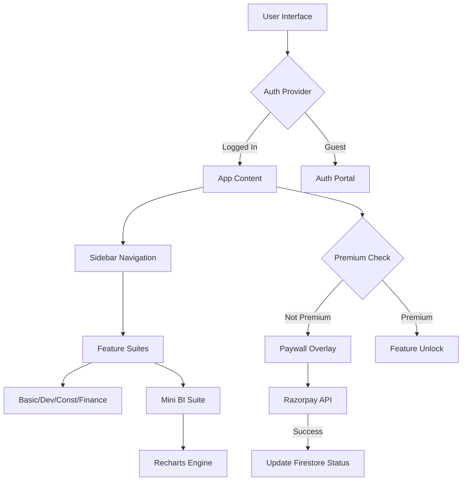

<div align="center">
  

  # 💎 CalQube: Premium SaaS Calculation Logic & BI Suite
  
  **The ultimate multi-purpose calculation platform with integrated paywalls, cloud persistence, and enterprise-grade data analytics.**

  [](https://Mmaneesh007.github.io/calculator)
  [](https://react.dev/)
  [](https://vitejs.dev/)
  [](https://firebase.google.com/)
  [](https://razorpay.com/)

  <p align="center">
    <a href="#-key-features">Features</a> •
    <a href="#-technical-stack">Stack</a> •
    <a href="#-architecture">Architecture</a> •
    <a href="#-local-setup">Setup</a> •
    <a href="#-contact">Contact</a>
  </p>
</div>

---

## 🚀 Business Value & Overview

**CalQube** is more than just a calculator; it's a full-featured **Software-as-a-Service (SaaS)** demonstration. It solves the challenge of monetizing specialized logic by integrating a robust paywall system directly into a multi-vertical utility suite.

Whether you are a developer needs complex logic, a construction pro calculating materials, or a finance analyst tracking ROI, CalQube provides a premium environment to get the job done—securely and persistently.

### 💼 Why CalQube?
- **Monetization Ready**: Integrated Razorpay checkout flow with "Live" key configurations.
- **Enterprise Security**: Role-based access control (RBAC) powered by Firebase Authentication.
- **Cloud Scale**: Firestore backend ensures user data and configurations are synced across devices.
- **Micro-SaaS blueprint**: A perfect foundation for anyone looking to build a paywalled utility.

---

## 🌟 Key Features

### 📐 Multi-Vertical Suites
- **💻 Developer Suite**: Modern tools for bitwise operations, color conversions, and regex testing.
- **🏗️ Construction Suite**: Material estimation, area calculations, and structural unit conversions.
- **📊 Finance Suite**: ROI calculators, mortgage estimations, and compounded interest projections.
- **🧪 Basic Logic**: The core calculation engine for everyday tasks.

### 📉 Mini Business Intelligence (BI)
- **Data Ingestion**: Support for CSV/Excel file uploads.
- **Visualization**: Interactive charts powered by **Recharts** to transform raw data into insights.
- **Export Engine**: Export results as high-quality **PDFs** or **PNG** images for stakeholder reporting.

### 🔒 Premium Experience
- **Smart Paywall**: Blurs results and locks high-tier suites for free users.
- **Seamless Upgrade**: One-click checkout using UPI, Cards, or Netbanking.
- **Persistence**: Remembers your "Premium" status and previous configurations via Firestore.

---

## 💻 Technical Stack

### **Frontend & UX**
- **React 19**: Leveraging the latest concurrent rendering features.
- **Vite & ESM**: Ultra-fast build times and modern module loading.
- **Vanilla CSS3**: High-performance "Glassmorphism" UI without the overhead of heavy CSS frameworks.
- **Lucide React**: For sleek, consistent iconography.

### **Backend & Cloud**
- **Firebase Auth**: Secure login/signup and session management.
- **Cloud Firestore**: NoSQL real-time database for user profiles and SaaS state.
- **Razorpay SDK**: Industrial-standard payment gateway integration.

### **Utilities**
- **Recharts**: For dynamic, responsive SVG charts.
- **jsPDF & html2canvas**: For client-side document generation.
- **XLSX**: For robust spreadsheet parsing.

---

## 🏗️ Architecture

CalQube follows a **Unidirectional Data Flow** pattern with centralized state management using the **React Context API**.



---

## 🛠️ Local Setup

Experience CalQube on your local environment in minutes:

1. **Clone & Enter**:
   ```bash
   git clone https://github.com/Mmaneesh007/calculator.git
   cd calculator
   ```

2. **Dependencies**:
   ```bash
   npm install
   ```

3. **Cloud Configuration**:
   Create a `.env` file in the root and add your Firebase and Razorpay credentials:
   ```env
   VITE_FIREBASE_API_KEY=your_key
   VITE_FIREBASE_AUTH_DOMAIN=your_domain
   VITE_RAZORPAY_KEY_ID=your_razorpay_id
   ```

4. **Launch**:
   ```bash
   npm run dev
   ```

---

## 🤝 Contributing & Licensing

Contributions drive the open-source community! 
1. **Fork** the Project
2. Create your **Feature Branch** (`git checkout -b feature/AmazingFeature`)
3. **Commit** your Changes (`git commit -m 'Add some AmazingFeature'`)
4. **Push** to the Branch (`git push origin feature/AmazingFeature`)
5. Open a **Pull Request**

---

## 📧 Contact

**Manish Sau**  
Founder & Developer  

[](https://www.linkedin.com/in/manish-sau-2875b844/)
[](mailto:maneeshsau2002@gmail.com)

---

<div align="center">
  <sub>Built with precision by <b>Mmaneesh007</b>. © 2026 CalQube SaaS.</sub>
</div>
